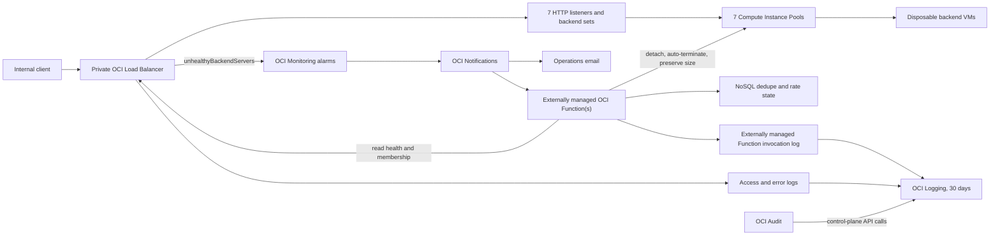
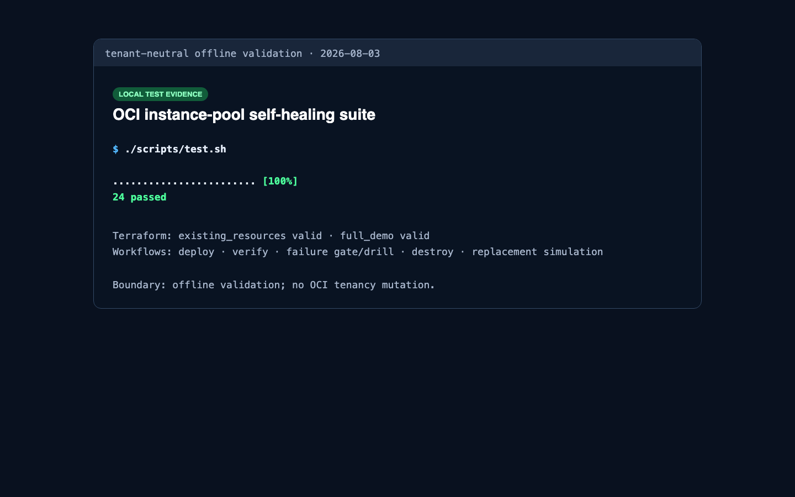
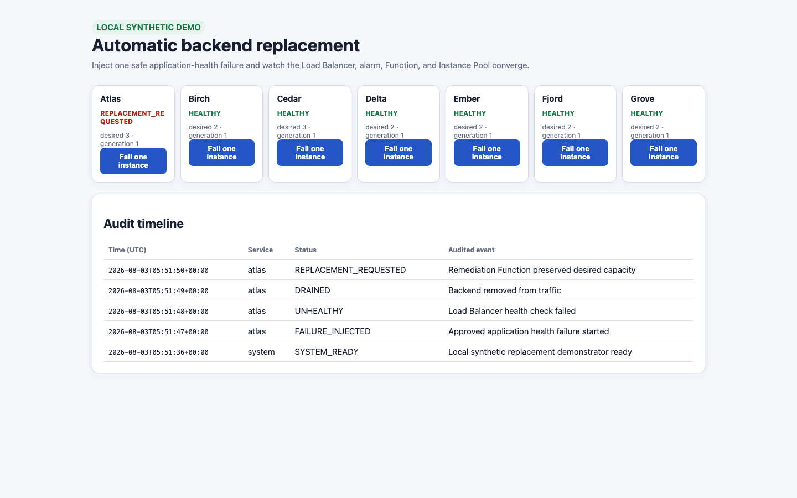
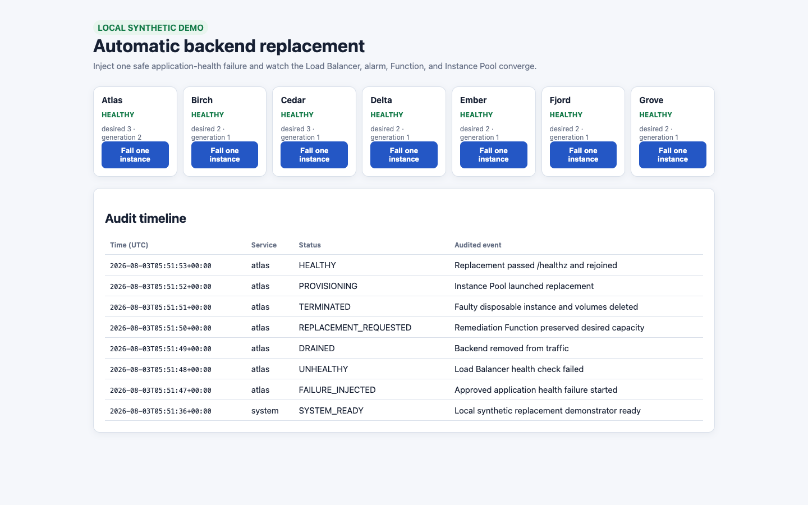

# OCI Instance Pool Self-Healing

This repository provides a tenant-neutral, Terraform-owned implementation for
automatically replacing an unhealthy OCI Compute Instance Pool member detected
by an OCI Load Balancer. It contains no tenancy identifiers, addresses, email
endpoints, credentials, console URLs, or source-environment images.
This repo is a personal 
repo and it’s not an official Oracle product. You need to bring changes to the code to meet your needs. This is Demo/PoC intended code andit must used under the user full responsability.

Two deployment modes are intentionally separate:

| Mode | Use when | Ownership |
|---|---|---|
| `infra/full_demo` | You need a disposable end-to-end test with seven synthetic services. | This state owns the VCN, private Load Balancer, pools, autoscaling, LB logs, NoSQL, notification topics, alarms, and Function subscriptions. OCI Function applications/functions, Function logs, Dynamic Groups, and IAM policies are external. |
| `infra/existing_resources` | Pools and Load Balancer backend sets already exist. | The existing resources remain dependency-only; this state owns only the remediation control path. Use a fresh state key for every adopted topology. |

Start here:

```bash
python3 -m pip install -r requirements-dev.txt
./scripts/test.sh
```

The command performs Terraform format/validation, shell validation, Function
and topology tests, an end-to-end deterministic replacement simulation, and a
privacy scan without contacting OCI.

For existing production resources, follow
[the manual and scripted adoption runbook](docs/MANUAL_EXISTING_RESOURCES.md).

## Architecture



All endpoints are private. Each listener uses HTTP on its configured backend
port and checks `GET /healthz`; a healthy backend must return HTTP 200 with a
body matching `healthy`. The Function uses resource-principal OCI SDK calls to
the Load Balancer, Compute Management, and NoSQL APIs. Terraform is the sole
owner of the disposable base stack. Function deployment, Function IAM, and
Function invocation logging remain external to this repository.

## External Function integration

This repository does **not** create an OCI Function application, Function,
OCIR repository, Function image, Function invocation log, Dynamic Group, or
IAM policy. It creates the synthetic infrastructure and control-path resources
(networking, Load Balancer, Instance Pools, NoSQL state tables, notification
topics, Load Balancer logs, alarms, and Function subscriptions). This keeps the
Function deployment separate for easier testing and avoids Terraform changing
or deleting an externally deployed Function.

1. Apply the base stack with `enable_function = false`. Terraform prints the
   sensitive `function_config_yaml` output needed by an external Function.
2. Copy the configuration generated by Terraform into the external Function's
   `func.yaml`. The output is sensitive because it contains resource OCIDs. For
   example, to print the Atlas configuration from a local state file:

   ```bash
   terraform -chdir=infra/full_demo output \
     -state="$PWD/.state/terraform/self-healing-full-demo/terraform.tfstate" \
     -json function_config_yaml | jq -r '.atlas'
   ```

3. Build and deploy the Function separately, starting with `MODE: observe`.
   For example, [OCI CDK](https://www.npmjs.com/package/@mikarinneoracle/oci-cdk)
   can deploy the repository's Function source into the Function subnet without
   an OCIR login:

   ```bash
   export OCI_STACK_ACTION="function-only"
   export OCI_COMPARTMENT_ID="<COMPARTMENT_OCID>"
   export OCI_FUNCTION_SUBNET_ID="<FUNCTION_SUBNET_OCID>"
   export OCI_FUNCTION_APP_NAME="self-healing-demo-functions"

   npx ocdk deploy
   ```

   OCI CLI authentication must already be configured. The Function deployment
   tool owns its app, image, and invocation log lifecycle; Terraform does not.

4. Re-run Terraform with the deployed Function OCID. Add it to a local,
   untracked tfvars file and enable only the services that should invoke it:

   ```hcl
   enable_function = true
   external_function_ids = {
     atlas = "<ATLAS_FUNCTION_OCID>"
   }
   ```

   When using `scripts/deploy_full_demo.sh`, the equivalent runtime inputs are:

   ```bash
   export SELF_HEALING_DEMO_ENABLE_FUNCTION=true
   export SELF_HEALING_DEMO_EXTERNAL_FUNCTION_IDS='{"atlas":"<ATLAS_FUNCTION_OCID>"}'
   SELF_HEALING_DEMO_APPLY_APPROVED=true ./scripts/deploy_full_demo.sh
   ```

With `enable_function = true`, Terraform creates or reconciles only the
per-service Monitoring alarm and ONS subscription. With it set to `false`, it
creates neither. It never creates, updates, imports, or destroys the external
Function resources or their IAM/logging configuration.

Before a remediation-mode test, ensure the external Function's Dynamic Group
and IAM policies allow its resource principal to read the Load Balancer and
NoSQL state and to manage the required Instance Pool/instances. Terraform does
not validate or manage those external permissions.

## Service capabilities

| OCI service | Capability in this design |
|---|---|
| Load Balancer | Private HTTP ingress, seven listeners/backend sets, active health checks, automatic traffic removal, access logs, and health-check error logs. |
| Compute Instance Pools | Per-service desired capacity and placement; detaching with auto-termination deletes the failed disposable VM while `isDecrementSize=false` triggers replacement. |
| Autoscaling | Independent minimum, initial, maximum, CPU thresholds, and cooldown per synthetic service. |
| Monitoring | One `oci_lbaas.unhealthyBackendServers` alarm per backend set with a three-minute pending duration. |
| Notifications | Alarm fan-out to the remediation Function and optional operations email. Email subscriptions require recipient confirmation. |
| Functions (external) | Re-reads live health and pool membership, fails closed on ambiguity, applies minimum-capacity and rate guards, and requests exactly one replacement. |
| NoSQL Database | Per-service idempotency keys and bounded replacement-window counters. No workload or customer data is stored. |
| Logging | The external Function invocation log contains structured remediation decisions; Terraform manages Load Balancer access/error logs with 30-day retention by default. |
| Audit | OCI automatically records control-plane calls. Use Audit to attribute Terraform, Function, and operator API actions; it complements, but does not replace, service logs. |
| OCIR (external) | Holds the Function image when required by the external Function deployment process. |
| IAM (external) | Dynamic Group and least-privilege policies for health reads, pool replacement, NoSQL state, and Notifications. |
| VCN, NAT, NSGs | Private LB, backend, and Function subnets; only approved internal client CIDRs reach listeners; outbound OCI API and package access uses NAT. |

## Prerequisites

- Terraform 1.5 or newer.
- An OCI CLI profile with permission to create the documented base resources.
- A compartment, tenancy identifier, and region. Docker/OCIR access is needed
  only when building and deploying the external Function.
- Sufficient limits for one flexible Load Balancer, seven pools, the requested
  VM count, Functions, alarms, NoSQL tables, and Logging resources.
- A unique state key. Never reuse this managed state to adopt existing resources.

No tenant value belongs in Git. Supply all identifiers and email addresses as
runtime environment variables.

## Deploy

The first invocation validates the synthetic topology, initializes Terraform,
and saves plans without applying them:

```bash
export OCI_CONFIG_PROFILE="<PROFILE>"
export OCI_COMPARTMENT_ID="<COMPARTMENT_OCID>"
export OCI_TENANCY_ID="<TENANCY_OCID>"
export OCI_REGION="<REGION>"
export SELF_HEALING_DEMO_STATE_KEY="self-healing-seven-service-lab"
export SELF_HEALING_DEMO_ALLOWED_CLIENT_CIDR="<INTERNAL_CLIENT_CIDR>"
export SELF_HEALING_DEMO_OPERATIONS_EMAIL="<OPERATIONS_EMAIL>"

./scripts/deploy_full_demo.sh
```

Review both plans, confirm the Load Balancer is private, and confirm every
resource has the synthetic prefix. Apply the exact reviewed lifecycle:

```bash
SELF_HEALING_DEMO_APPLY_APPROVED=true ./scripts/deploy_full_demo.sh
```

After the base apply, follow [External Function integration](#external-function-integration)
to deploy the Function independently and add its OCID. Start the Function in
`observe` mode. Confirm every email subscription before expecting operational
mail.

## Verify

```bash
./scripts/verify_full_demo.sh
python3 scripts/topology.py \
  --config config/seven_service.example.json validate
pytest -q tests/test_self_healing.py \
  tests/test_seven_service_topology.py \
  tests/test_demo_app.py
```

Acceptance requires seven active listeners/backend sets, every pool at desired
capacity, every backend healthy, alarm and Function subscriptions active,
Function/LB logs enabled, and no active replacement work request.

## Failure and replacement drill

First run the production Function in `observe` mode and confirm that a failure
is detected without mutation. Then change the reviewed Terraform input to
`function_mode = "remediate"`, plan, apply, and run one bounded drill:

```bash
export SELF_HEALING_DEMO_FAILURE_SERVICE="atlas"
SELF_HEALING_DEMO_SIMULATION_APPROVED=true \
  ./scripts/simulate_full_demo_failure.sh
```

The script changes only the selected synthetic VM health marker. Expected flow:

1. `/healthz` stops returning the expected healthy result.
2. Load Balancer removes that member from traffic and emits health evidence.
3. Monitoring fires after the pending duration; Notifications invokes the Function and sends email.
4. The Function revalidates exactly one unhealthy pool member and all safety guards.
5. It detaches with auto-termination and preserves desired pool size.
6. Instance Pool launches a new VM; the old boot/attached disposable volumes may be deleted.
7. The new VM passes `/healthz`, joins the backend set, and the alarm clears.
8. OCI Logging retains the LB transition and structured Function decision; OCI Audit retains API attribution.

Record convergence time from first unhealthy transition to replacement health.
The default demonstration target is 15 minutes; choose a production SLO from
observed boot, application-start, alarm-pending, and capacity data.

## Local test/demo application

The local application demonstrates the same state machine without OCI access or
tenant data:

```bash
python3 demo/self_healing_app/server.py --port 8042
curl -s http://127.0.0.1:8042/healthz
curl -s -X POST "http://127.0.0.1:8042/api/fail?service=atlas"
curl -s http://127.0.0.1:8042/api/state
```

Open `http://127.0.0.1:8042`, fail one synthetic member, and observe
`UNHEALTHY -> DRAINED -> REPLACEMENT_REQUESTED -> TERMINATED -> PROVISIONING -> HEALTHY`.
The local audit file is JSON Lines and is test evidence only; in OCI, equivalent
decisions are structured records in the Function invocation log.

## Local evidence

These screenshots were produced solely from the synthetic local application
and focused test run. They are not OCI deployment proof and contain no tenant data.







## OCI Logging and audit queries

Terraform manages the two Load Balancer service-log streams in one group. The
Function invocation log is configured with the external Function application:

- Load Balancer `access`: request routing and response timing.
- Load Balancer `error`: health-check transitions and backend errors.

Search examples in **Observability & Management > Logging > Search**:

```text
search "<LOG_GROUP_OCID>" | data.message = '*self_healing_decision*'
search "<LOG_GROUP_OCID>" | data.message = '*healthChecker*'
```

Do not paste query results into tickets without redaction: LB logs can include
private client/backend addresses. OCI Audit is available separately under
**Identity & Security > Audit** and is searchable alongside other logs.

## Observability BOM

This is a usage formula, not a quote. Validate current regional/contract pricing
with the [OCI Cost Estimator](https://www.oracle.com/cloud/costestimator.html)
before approval.

| Item | Quantity in this stack | Monthly cost formula | Small-demo expectation |
|---|---:|---|---|
| Monitoring metric ingestion | 7 LB alarm streams plus native metrics | `max(0, ingested datapoints - 500M free) / 1M x current rate` | Usually $0 within the first 500M datapoints. |
| Monitoring retrieval | Verification and console queries | `max(0, retrieved datapoints - 1B free) / 1M x current rate` | Usually $0 within the first 1B datapoints. |
| Alarms | 7 | No separate alarm charge; metric retrieval/ingestion rules apply. | $0 in the stated envelope. |
| OCI Logging storage | Function invoke + LB access/error, 30-day retention | `max(0, retained GB-month - 10 GB free) x current GB-month rate` | $0 if total retained logs stay at or below 10 GB/month. |
| Notifications delivery | Function and email fan-out | `max(0, deliveries - 1M free)` plus `max(0, emails - 1,000 free)` at current rates | $0 for normal drills. |
| Functions | Alarm-driven invocations, 512 MB, up to 120 s | Invocations above 2M plus GB-seconds above 400,000 at current rates | $0 for normal drills. |
| NoSQL state | 7 on-demand 1 GB-limit tables | Actual on-demand read/write/storage usage at the regional rate | Low but not assumed free; estimate from expected alarm volume. |
| OCI Audit | Tenancy control-plane events | Included OCI capability; retention/archival policy can add downstream storage costs. | No separate component resource. |

The principal non-observability costs are Compute, boot volume storage, the
10-Mbps flexible Load Balancer, NAT processing/traffic, and outbound transfer.
They depend on each service's min/initial/max capacity and drill duration, so
enter the exact regional shape and runtime into the Cost Estimator. Oracle's
[cloud price list](https://www.oracle.com/cloud/price-list/) is the rate source;
the first 10 GB of Logging storage, 500M Monitoring ingestion datapoints, 1B
retrieval datapoints, 1M Notifications deliveries, and 1,000 emails are listed
as monthly free allowances at the time this guide was updated.

## Manual Console implementation

For an existing environment, do not deploy this owning stack. Follow
[the manual existing-resource runbook](docs/MANUAL_EXISTING_RESOURCES.md),
which covers discovery, ownership, health checks, NoSQL, OCIR/Functions, IAM,
Notifications, Monitoring, Logging, observe-mode validation, remediation-mode
acceptance, rollback, and removal. Map each existing backend set to exactly one
instance pool; create one independent alarm, topic, Function configuration, and
state key per service.

For a new Console-only test, create resources in the same order as the
architecture diagram: network and NSGs, private LB/listeners/backend sets,
instance configurations/pools/autoscaling, NoSQL, OCIR Function application and
Functions, IAM, Notifications, Monitoring alarms, then Function and LB service
logs. Start in observe mode and enable one service at a time.

## Destroy

Destroy has a separate approval gate and must use the original state key:

```bash
export SELF_HEALING_DEMO_STATE_KEY="self-healing-seven-service-lab"
./scripts/destroy_full_demo.sh
# Review the destroy plan and verify it contains only this synthetic stack.
SELF_HEALING_DEMO_DESTROY_APPROVED=true ./scripts/destroy_full_demo.sh
```

Confirm the Load Balancer, pools/VMs and disposable volumes, Functions, OCIR
repository, NoSQL tables, alarms, topics/subscriptions, log resources, network,
dynamic group, and policy are absent. Retain only redacted evidence required by
your audit policy; never retain Terraform state as documentation.

## Safety and evidence boundary

- Apply, failure injection, and destroy require independent review and approval.
- One unhealthy candidate is the maximum automatic action per invocation.
- Minimum healthy capacity and replacement-rate guards fail closed.
- Local tests and screenshots prove code behavior only. Live OCI acceptance
  requires a reviewed plan/apply, email confirmation, observed alarm delivery,
  Function convergence, log ingestion, and verified destroy in the named tenancy.
