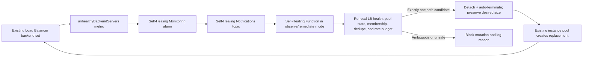

# Self-Healing Manual Installation on Existing OCI Resources

This runbook installs the Self-Healing self-healing control path around an existing OCI
Compute instance pool and an existing Load Balancer backend set. It is intended
for operators who cannot use the supplied Terraform module or who need to
integrate Self-Healing into infrastructure owned by another stack.

Start in `MODE=observe`. Do not enable remediation until every validation in
this document passes.

For a seven-backend worked example and the full per-service Console sequence,
see [Self-Healing Seven-Service Synthetic Topology](SEVEN_SERVICE_USE_CASE.md).
It uses generated service names and diagrams only; no source-environment image
or tenancy data is included.

## Supported adoption boundary

The existing resources remain owned by their current Terraform stack, Resource
Manager stack, or operations team:

- Compute instance pool and its instance configuration.
- Autoscaling configuration, if one exists.
- Load balancer, listener, backend set, health checker, NSGs, security lists,
  routes, certificates, and DNS.
- Application installation and application-specific health endpoint.

Self-Healing does not import, update, or destroy those resources. The Self-Healing installation
owns only:

- A private OCIR repository and OCI Functions application/function.
- A Notifications topic and `ORACLE_FUNCTIONS` subscription.
- A Monitoring alarm for `oci_lbaas.unhealthyBackendServers`.
- A NoSQL table for event deduplication and replacement-rate state.
- A Function dynamic group and compartment-scoped policy.
- A Logging group and Function invocation log.

The existing instance pool must already be attached to exactly one matching
load-balancer/backend-set pair. The pool must have at least two members, and its
health checker must detect application failure while the VM remains `RUNNING`.
Self-Healing intentionally fails closed if multiple members are unhealthy.



## Prerequisites and inventory

Record these values in a protected local worksheet; never commit them:

```text
<TENANCY_OCID>
<COMPARTMENT_OCID>
<REGION>
<PRIVATE_FUNCTION_SUBNET_OCID>
<EXISTING_INSTANCE_POOL_OCID>
<EXISTING_LOAD_BALANCER_OCID>
<EXISTING_BACKEND_SET_NAME>
<FUNCTION_IMAGE>
```

Confirm:

1. The pool lifecycle is `RUNNING` and its desired size is at least 2.
2. The load balancer lifecycle is `ACTIVE`.
3. The pool attachment references the selected LB and backend set exactly once.
4. The backend set has an HTTP, HTTPS, or TCP health checker.
5. Backend health is `OK` before installation.
6. The health endpoint represents application readiness, not only VM or port
   availability.
7. The Function subnet can reach OCI service APIs through a service gateway or
   NAT gateway.
8. Service limits allow one Function application, function, Notifications
   topic/subscription, alarm, NoSQL table, log group/log, and OCIR repository.

Repository users can perform the read-only topology check:

```bash
export OCI_COMPARTMENT_ID="<COMPARTMENT_OCID>"
export SELF_HEALING_EXISTING_INSTANCE_POOL_ID="<EXISTING_INSTANCE_POOL_OCID>"
export SELF_HEALING_EXISTING_LOAD_BALANCER_ID="<EXISTING_LOAD_BALANCER_OCID>"
export SELF_HEALING_EXISTING_BACKEND_SET_NAME="<EXISTING_BACKEND_SET_NAME>"
./scripts/validate_existing_resources.sh
```

## Console procedure

### 1. Verify the existing data plane

1. Open **Networking → Load Balancers**, select the existing load balancer,
   then open **Backend sets**.
2. Select the backend set and verify its health checker protocol, port, path,
   expected status, timeout, retry count, and SSL/plaintext behavior.
3. Confirm every current backend is healthy.
4. Open **Compute → Instance Pools**, select the pool, and verify its load
   balancer attachment points to that exact backend set.
5. Confirm the pool size is at least 2 and the pool is not currently scaling.

### 1a. Verify logging ownership before deployment

1. Open **Observability & Management → Logging → Logs** and inspect service
   logs for the existing Load Balancer. Confirm access and error logs are
   enabled and routed to the operator-approved log group and retention policy.
2. If either log is absent, enable it in the Terraform/Resource Manager stack
   that already owns the Load Balancer, or through the Console only when that
   resource is not managed as code. Do not create a second competing log
   resource or import an existing log into this integration state.
3. The adoption module owns only its Function invocation log. OCI Audit records
   the Function, Terraform, and operator control-plane API calls independently;
   verify the operational team can query Audit for the target compartment.

### 2. Create state, image, and topic resources

1. Under **NoSQL Database → Tables**, create a table with this schema:

   ```sql
   CREATE TABLE <SELF_HEALING_STATE_TABLE> (
     event_key STRING,
     created_epoch LONG,
     pool_id STRING,
     backend_name STRING,
     action STRING,
     detail STRING,
     PRIMARY KEY(SHARD(event_key))
   )
   ```

   Use on-demand capacity and the minimum suitable storage.

2. Under **Developer Services → Container Registry**, create a private
   repository such as `self_healing/health-remediator`.
3. Build the repository's
   `functions/health_remediator/Dockerfile` for `linux/amd64`, push it, and
   retain the immutable image digest used for deployment.
4. Under **Developer Services → Application Integration → Notifications**,
   create the Self-Healing topic.

### 3. Create the Function

1. Open **Developer Services → Functions → Applications** and create an
   application in the private Function subnet.
2. Create a function from the published image with 512 MB memory and a
   120-second timeout.
3. Configure:

   ```text
   MODE=observe
   COMPARTMENT_ID=<COMPARTMENT_OCID>
   LOAD_BALANCER_ID=<EXISTING_LOAD_BALANCER_OCID>
   BACKEND_SET_NAME=<EXISTING_BACKEND_SET_NAME>
   INSTANCE_POOL_ID=<EXISTING_INSTANCE_POOL_OCID>
   STATE_TABLE_ID=<SELF_HEALING_STATE_TABLE_OCID>
   STATE_TABLE_NAME=<SELF_HEALING_STATE_TABLE>
   STATUS_TOPIC_ID=<SELF_HEALING_TOPIC_OCID>
   MIN_HEALTHY_BACKENDS=1
   MAX_REPLACEMENTS_PER_WINDOW=2
   REPLACEMENT_WINDOW_SECONDS=1800
   ```

### 4. Create IAM

Create a dynamic group matching only the new Function OCID. Add the
compartment-scoped policy from [IAM policy](#iam-policy). IAM/resource-principal
changes can take several minutes to become effective.

### 5. Create Notifications and the alarm

1. Open the Self-Healing topic and add a subscription with protocol **Function**,
   selecting the Self-Healing Function.
   Function subscriptions do not require confirmation.
2. Under **Observability & Management → Monitoring → Alarm Definitions**,
   create an alarm:

   ```text
   Namespace: oci_lbaas
   Query:
   unhealthyBackendServers[1m]{
     resourceId = "<EXISTING_LOAD_BALANCER_OCID>",
     backendSetName = "<EXISTING_BACKEND_SET_NAME>"
   }.max() > 0
   Pending duration: 3 minutes
   Severity: Critical
   Destination: <SELF_HEALING_TOPIC>
   ```

3. Under **Logging → Log Groups**, create a log group and enable the Functions
   application invocation service log with an appropriate retention period.

## CLI procedure

The examples use placeholders deliberately. Repository operators should load
the supplied wrapper before running OCI CLI calls; Cloud Shell users can use
the same wrapper after cloning the repository.

```bash
source ./scripts/common.sh
```

```bash
export COMPARTMENT_ID="<COMPARTMENT_OCID>"
export POOL_ID="<EXISTING_INSTANCE_POOL_OCID>"
export LB_ID="<EXISTING_LOAD_BALANCER_OCID>"
export BACKEND_SET="<EXISTING_BACKEND_SET_NAME>"
export FUNCTION_ID="<SELF_HEALING_FUNCTION_OCID>"
export TOPIC_ID="<SELF_HEALING_TOPIC_OCID>"
```

Read and validate before creating anything:

```bash
oci_cli compute-management instance-pool get \
  --instance-pool-id "$POOL_ID"
oci_cli lb load-balancer get --load-balancer-id "$LB_ID"
oci_cli lb backend-set get \
  --load-balancer-id "$LB_ID" \
  --backend-set-name "$BACKEND_SET"
oci_cli lb backend-set-health get \
  --load-balancer-id "$LB_ID" \
  --backend-set-name "$BACKEND_SET"
```

Create the Function subscription after the topic and Function exist:

```bash
oci_cli ons subscription create \
  --compartment-id "$COMPARTMENT_ID" \
  --topic-id "$TOPIC_ID" \
  --protocol ORACLE_FUNCTIONS \
  --subscription-endpoint "$FUNCTION_ID"
```

Create the alarm from a protected `0600` JSON payload or with Terraform. Its MQL
query must be exactly scoped to the selected LB and backend set:

```text
unhealthyBackendServers[1m]{
  resourceId = "<EXISTING_LOAD_BALANCER_OCID>",
  backendSetName = "<EXISTING_BACKEND_SET_NAME>"
}.max() > 0
```

For the repository-supported non-owning deployment:

```bash
export OCI_CONFIG_PROFILE="<PROFILE>"
export OCI_REGION="<REGION>"
export OCI_TENANCY_ID="<TENANCY_OCID>"
export OCI_COMPARTMENT_ID="<COMPARTMENT_OCID>"
export OCI_PRIVATE_SUBNET_ID="<PRIVATE_FUNCTION_SUBNET_OCID>"
export SELF_HEALING_EXISTING_INSTANCE_POOL_ID="<EXISTING_INSTANCE_POOL_OCID>"
export SELF_HEALING_EXISTING_LOAD_BALANCER_ID="<EXISTING_LOAD_BALANCER_OCID>"
export SELF_HEALING_EXISTING_BACKEND_SET_NAME="<EXISTING_BACKEND_SET_NAME>"
export SELF_HEALING_STATE_KEY="self_healing-existing-production"
export SELF_HEALING_FUNCTION_MODE=observe
# Unless the target OCIR registry is already authenticated in Docker:
export SELF_HEALING_OCIR_USER_NAME="<OCI_USER_NAME>"
export SELF_HEALING_OCIR_AUTH_TOKEN="<PROTECTED_RUNTIME_SECRET>"

./scripts/validate_existing_resources.sh
./scripts/deploy_existing.sh
# Review the saved plan. It must not create, import, update, or destroy the
# existing pool, load balancer, backend set, listener, or autoscaling policy.
SELF_HEALING_APPLY_APPROVED=true ./scripts/deploy_existing.sh
# Review the separately saved Function/image plan, then apply that exact plan.
SELF_HEALING_APPLY_APPROVED=true \
SELF_HEALING_FUNCTION_APPLY_APPROVED=true ./scripts/deploy_existing.sh
```

Always use a fresh `SELF_HEALING_STATE_KEY` when adopting an existing topology. Never
switch an existing Self-Healing-managed state between managed and non-owning modes; the
deployment script rejects that ownership transition. Reuse the same state key
for verify and destroy.

## IAM policy

Replace the placeholders and use the exact dynamic-group name. These grants are
for the Function resource principal, not the deploying human:

```text
Allow dynamic-group <SELF_HEALING_FUNCTION_DYNAMIC_GROUP> to read load-balancers in compartment id <COMPARTMENT_OCID>
Allow dynamic-group <SELF_HEALING_FUNCTION_DYNAMIC_GROUP> to manage instance-pools in compartment id <COMPARTMENT_OCID>
Allow dynamic-group <SELF_HEALING_FUNCTION_DYNAMIC_GROUP> to manage instances in compartment id <COMPARTMENT_OCID>
Allow dynamic-group <SELF_HEALING_FUNCTION_DYNAMIC_GROUP> to use vnics in compartment id <COMPARTMENT_OCID>
Allow dynamic-group <SELF_HEALING_FUNCTION_DYNAMIC_GROUP> to use subnets in compartment id <COMPARTMENT_OCID>
Allow dynamic-group <SELF_HEALING_FUNCTION_DYNAMIC_GROUP> to manage volume-attachments in compartment id <COMPARTMENT_OCID>
Allow dynamic-group <SELF_HEALING_FUNCTION_DYNAMIC_GROUP> to use volumes in compartment id <COMPARTMENT_OCID>
Allow dynamic-group <SELF_HEALING_FUNCTION_DYNAMIC_GROUP> to read nosql-tables in compartment id <COMPARTMENT_OCID>
Allow dynamic-group <SELF_HEALING_FUNCTION_DYNAMIC_GROUP> to use nosql-rows in compartment id <COMPARTMENT_OCID>
Allow dynamic-group <SELF_HEALING_FUNCTION_DYNAMIC_GROUP> to use ons-topics in compartment id <COMPARTMENT_OCID>
```

The deployer needs separate authority to create the Self-Healing-owned resources and IAM
objects. Keep that human/group policy separate from the runtime policy. If the
pool, LB, and Self-Healing resources reside in different compartments, create explicit
policies in the correct scope rather than broadening to tenancy-wide
`manage all-resources`.

## Validate before remediation

Do not promote from `MODE=observe` until all checks pass:

1. Query `oci_lbaas.unhealthyBackendServers` for the exact dimensions and
   confirm recent datapoints exist.
2. Invoke a non-firing payload and confirm the Function returns `IGNORED`.
3. Publish a synthetic firing-shaped notification while all backends are
   healthy and confirm remediation is blocked because no single unhealthy
   member exists.
4. Confirm Function logs contain no OCIDs, IP addresses, credentials, or
   notification payload secrets.
5. Perform an application-specific failure on one running member. Do not stop
   the VM: OCI pool detach requires the instance to remain running.
6. Confirm the LB removes that backend from rotation and the alarm transitions
   from `OK` to `FIRING`.
7. While still in observe mode, confirm the Function reports `OBSERVED`.
8. Restore health and wait for the alarm to return to `OK`.
9. Change only the Function configuration to `MODE=remediate`.
10. Repeat the controlled one-backend failure and verify:
    - `REPLACEMENT_REQUESTED` appears once.
    - The old member disappears.
    - Desired pool size is unchanged.
    - The replacement registers healthy.
    - Replaying the same event produces no second detach.

Use a failure method owned by the application team, such as disabling only the
health endpoint or changing an explicit test-only health marker. Never use the
Self-Healing demo marker command on an unrelated workload.

## Rollback and removal

Emergency rollback is control-plane only and does not require changing the
existing pool or LB:

1. Set the Function back to `MODE=observe`.
2. Disable the alarm or remove its Notifications destination.
3. Disable/delete the Function subscription.
4. Confirm no replacement work request is active.
5. Leave the LB health checker operating; it continues removing unhealthy
   backends from traffic without terminating instances.

For full removal, delete only Self-Healing-owned resources in dependency order:

1. Alarm.
2. Function subscription.
3. Function and Functions application.
4. Function service log and log group.
5. Dynamic-group policy, then dynamic group.
6. Notifications topic.
7. NoSQL state table.
8. OCIR repository only after retaining any required image evidence.

Do not delete or import the existing pool, autoscaling configuration, LB,
listener, backend set, backend registrations, network rules, or application
health endpoint. Repository users should review
`./scripts/destroy_existing.sh`; in existing-resource mode its plan must
contain only Self-Healing-owned resources.

## Operational checklist

- Keep replacement mode observable and explicitly controlled.
- Alarm if the Self-Healing Function itself errors or is throttled.
- Review NoSQL replacement-window records during incidents.
- Retain Function logs long enough for incident investigation.
- Test one failure at a time and wait for pool `RUNNING` before another drill.
- Revalidate IAM after policy changes; resource-principal tokens are cached.
- Reconcile any emergency CLI action with the owning Terraform/Resource Manager
  stack.

Official references:

- [Load Balancer health check policies](https://docs.oracle.com/en-us/iaas/Content/Balance/Tasks/load_balancer_health_management.htm)
- [Load Balancer metrics](https://docs.oracle.com/en-us/iaas/Content/Balance/Reference/loadbalancermetrics.htm)
- [Creating a Function subscription](https://docs.oracle.com/iaas/Content/Notification/Tasks/create-subscription-function.htm)
- [Functions resource principals](https://docs.oracle.com/en-us/iaas/Content/Functions/Tasks/functionsaccessingociresources.htm)
- [Detaching an instance-pool member](https://docs.oracle.com/en-us/iaas/Content/Compute/Tasks/updatinginstancepool-detaching-an-instance-from-an-instance-pool.htm)
