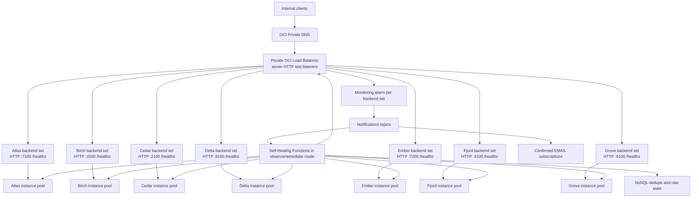

# Self-Healing Seven-Service Synthetic Topology

This document shows how to apply Self-Healing self-healing to seven independent
application backends behind one **private OCI Load Balancer**. All service
names, ports, backend-set names, and diagrams in this example are synthetic.
The repository does not contain source-environment screenshots, email addresses, OCIDs,
IP addresses, registry namespaces, or other tenancy identifiers.

Use the example as a mapping template. Replace the synthetic service records
with protected runtime inputs for your environment; do not edit real values
into the committed example.

## What this use case implements

The synthetic topology contains these services:

| Service | Backend port | Minimum / initial / maximum | Cooldown | Minimum healthy |
|---|---:|---:|---:|---:|
| Atlas | 7100 | 2 / 3 / 5 | 300 seconds | 2 |
| Birch | 3100 | 2 / 2 / 4 | 420 seconds | 1 |
| Cedar | 2100 | 2 / 3 / 6 | 300 seconds | 2 |
| Delta | 9100 | 2 / 2 / 3 | 600 seconds | 1 |
| Ember | 7200 | 2 / 2 / 5 | 300 seconds | 1 |
| Fjord | 4100 | 2 / 2 / 4 | 480 seconds | 1 |
| Grove | 6100 | 2 / 2 / 3 | 600 seconds | 1 |

The numbers demonstrate that every backend may have an independent capacity
and remediation policy. They are test values, not production recommendations.



The managed test implementation uses one Terraform state for the complete
synthetic stack and creates one independent pool, autoscaling policy, backend
set, listener, alarm, topic, Function, and state table per service. The shared
state gives the test one reviewed apply and one complete destroy boundary. The
services share a private OCI Load Balancer, but never share an instance pool.

## Repository artifacts and code mapping

| Requirement | Repository artifact | How it fits |
|---|---|---|
| Synthetic topology | `config/seven_service.example.json` | Names seven services and references runtime environment variables instead of real IDs or email addresses. |
| Validation and planning | `scripts/topology.py` | Validates uniqueness, ports, health paths, capacity bounds, minimum healthy capacity, private LB, and email channel. Emits redacted summaries. |
| Local end-to-end simulation | `scripts/topology.py ... simulate` | Simulates alarm, LB removal, Function replacement, duplicate suppression, desired-size preservation, and recovery for all seven services without contacting OCI. |
| Per-service infrastructure | `infra/existing_resources/` | Creates or integrates the alarm, ONS, Function, NoSQL state, logging, IAM, and optional managed pool/LB resources. |
| Remediation decision | `functions/health_remediator/func.py` | Re-reads LB health and pool membership, requires exactly one candidate, enforces safety budgets, and detaches with auto-termination while preserving desired size. |
| Deployment lifecycle | `scripts/deploy_existing.sh` | Produces separately reviewed base and Function/image Terraform plans for the selected `SELF_HEALING_STATE_KEY`. |
| Verification | `scripts/verify_existing.sh` | Checks the selected state and control path. |
| Controlled failure | `scripts/simulate_existing_failure.sh` | Managed demo only; makes one running backend fail its application health check. Never use it against an unrelated workload. |
| Destroy | `scripts/destroy_existing.sh` | Plans and, with separate approval, destroys only resources owned by the selected state. |
| Contract tests | `tests/test_seven_service_topology.py` | Proves the synthetic fixture, redaction, complete managed state, production Function behavior, simulation result, and destroy scope. |
| Full Terraform stack | `infra/full_demo/` | Creates the VCN, private subnets, NAT, NSGs, private LB, seven listeners/backend sets/pools/autoscaling policies, OCIR, Functions, NoSQL, ONS/email, alarms, logging, and IAM. |
| Full lifecycle | `scripts/deploy_full_demo.sh`, `verify_full_demo.sh`, `simulate_full_demo_failure.sh`, and `destroy_full_demo.sh` | Produces a reviewed plan, applies base infrastructure, builds the amd64 Function image, applies the control paths, verifies all services, drills one service, and destroys the entire owned stack. |

## Run the local simulation

No OCI credentials or tenancy context are used:

```bash
python3 scripts/topology.py \
  --config config/seven_service.example.json \
  validate

python3 scripts/topology.py \
  --config config/seven_service.example.json \
  plan

python3 scripts/topology.py \
  --config config/seven_service.example.json \
  simulate

python3 scripts/topology.py \
  --config config/seven_service.example.json \
  destroy-plan

pytest -q \
  tests/test_self_healing.py \
  tests/test_seven_service_topology.py \
  tests/test_workflows_e2e.py
```

The simulation is deterministic contract proof. It does not prove OCI service
limits, IAM propagation, shape availability, image startup time, email
confirmation, real LB metrics, or a real Function invocation.

## Prepare your own topology safely

1. Copy the synthetic JSON to a protected location outside the repository.
2. Change only synthetic names, ports, capacity values, and environment-variable
   names in the protected copy.
3. Keep all OCIDs and the email endpoint in environment variables or a secret
   manager. Do not put them in JSON.
4. Run `validate` and `plan`.
5. Confirm each backend has its own instance pool if its capacity differs.
6. Confirm every pool has at least two instances before enabling destructive
   remediation.
7. Use a unique `SELF_HEALING_DEMO_STATE_KEY` for the complete managed test stack.
   Never reuse that state for existing-resource mode.

Example protected runtime variables for the complete owned test stack:

```bash
export OCI_CONFIG_PROFILE="<PROFILE>"
export OCI_REGION="<REGION>"
export OCI_TENANCY_ID="<TENANCY_OCID>"
export OCI_COMPARTMENT_ID="<COMPARTMENT_OCID>"
export SELF_HEALING_DEMO_STATE_KEY="synthetic-seven-service-lab"
export SELF_HEALING_DEMO_ALLOWED_CLIENT_CIDR="<INTERNAL_CLIENT_CIDR>"
export SELF_HEALING_DEMO_OPERATIONS_EMAIL="<OPERATIONS_EMAIL>"
export SELF_HEALING_DEMO_FUNCTION_MODE="observe"
export SELF_HEALING_OCIR_USER_NAME="<OCI_USER_NAME>"
export SELF_HEALING_OCIR_AUTH_TOKEN="<PROTECTED_AUTH_TOKEN>"

./scripts/deploy_full_demo.sh
# Review the saved base plan, then:
SELF_HEALING_DEMO_APPLY_APPROVED=true ./scripts/deploy_full_demo.sh
SELF_HEALING_DEMO_APPLY_APPROVED=true \
SELF_HEALING_DEMO_FUNCTION_APPLY_APPROVED=true ./scripts/deploy_full_demo.sh
./scripts/verify_full_demo.sh
```

The deploy script converts all seven JSON service records into protected
Terraform variables. For non-owning integration with existing resources, use
the separate procedure in `MANUAL_EXISTING_RESOURCES.md`.

## End-to-end OCI Console procedure

Perform the following for each service. Start with one non-production service,
complete the entire observe-mode test, then repeat.

### 1. Inventory and ownership

1. Record the compartment, region, private Function subnet, private LB, backend
   set, instance pool, and autoscaling configuration in a protected worksheet.
2. Identify the Terraform or Resource Manager stack that owns the LB, backend
   sets, pools, autoscaling, NSGs, certificates, and DNS.
3. Decide whether Self-Healing will own only the control path or also create the service
   pool. For existing production resources, use non-owning integration.
4. Confirm no second Terraform state or manual process will manage the same Self-Healing
   resources.

### 2. Configure the private OCI Load Balancer

1. Open **Networking → Load Balancers** and select or create a private
   **OCI Load Balancer**. Do not select Network Load Balancer.
2. For the disposable managed test, create seven private HTTP listeners on the
   seven synthetic service ports. For a production adaptation, replace these
   with the approved HTTPS listener and routing policy.
3. Create one backend set per service with `ROUND_ROBIN`.
4. Configure the HTTP health checker on the service's backend port:
   `GET /healthz`, expected status 200, 10-second interval, 3-second timeout,
   and 3 retries as an initial baseline.
5. Attach each instance pool to its matching backend set and port.
6. Map each private listener directly to its matching backend set. A production
   adaptation may consolidate these behind HTTPS host/path routing.
7. Apply an LB NSG that permits listener traffic only from approved internal
   sources. Permit backend traffic only from the LB NSG to the seven declared
   ports.
8. Confirm all backend sets are healthy before continuing.

### 3. Configure each instance pool and autoscaling policy

1. Open **Compute → Instance Configurations** and create a configuration for
   each service. Instances must be disposable and must externalize durable
   application state.
2. Open **Compute → Instance Pools** and create one pool per service.
3. Attach the service's private subnet and matching LB/backend-set pair.
4. Distribute placement across fault domains. Use multiple availability domains
   only when the application and subnet design support them.
5. Set each pool's initial capacity from the approved service worksheet.
6. Under **Autoscaling**, create the service-specific min, initial, max,
   cooldown, and scaling rules.
7. Select the approved capacity reservation, or document why on-demand capacity
   is acceptable.
8. Confirm the pool is `RUNNING`, not scaling, and has at least the approved
   minimum healthy count.

### 4. Configure volume deletion

1. Ensure the instance configuration does not preserve the boot volume after
   termination unless the application owner explicitly requires it.
2. Treat attached block volumes as persistent by default. Delete them
   automatically only when they are dedicated to one VM, reconstructible, and
   tagged with the organization's approved disposable-data tag.
3. Never delete shared, backup-bearing, or ambiguously owned volumes.
4. Self-Healing's current detach operation auto-terminates the VM; it does not provide a
   general-purpose shared-volume deletion engine. If data-volume deletion is
   required, implement it as a separately approved, tag-gated workflow and test
   it independently.

### 5. Create the Self-Healing state and delivery resources

1. Under **NoSQL Database → Tables**, create the state table using the schema in
   `MANUAL_EXISTING_RESOURCES.md`.
2. Under **Developer Services → Container Registry**, create a private
   repository.
3. Build `functions/health_remediator/Dockerfile` for `linux/amd64`, scan it,
   push it, and record the immutable digest.
4. Under **Developer Services → Functions**, create an application in the
   private subnet and a 512 MB Function with a 120-second timeout.
5. Configure the Function using the per-service variables shown above. Always
   start with `MODE=observe`.
6. Create the exact-function dynamic group and compartment-scoped IAM policy
   documented in `MANUAL_EXISTING_RESOURCES.md`.
7. Enable the Function invocation service log.

### 6. Create Notifications and email

1. Open **Developer Services → Application Integration → Notifications**.
2. Create a topic for the service's remediation control path.
3. Add a **Function** subscription selecting the service's Self-Healing Function. The
   API/Terraform protocol value for this subscription is `ORACLE_FUNCTIONS`.
4. Add an **Email** subscription for the approved operational distribution
   list.
5. The recipient must accept the confirmation email. Verify the subscription
   lifecycle is `ACTIVE`; `PENDING` subscriptions do not deliver.

### 7. Create the backend-health alarm

1. Open **Observability & Management → Monitoring → Alarm Definitions**.
2. Select namespace `oci_lbaas`.
3. Use a query scoped to the exact LB and backend set:

   ```text
   unhealthyBackendServers[1m]{
     resourceId = "<LOAD_BALANCER_OCID>",
     backendSetName = "<BACKEND_SET_NAME>"
   }.max() > 0
   ```

4. Set a three-minute pending duration initially, severity `Critical`, and the
   service's Notifications topic as destination.
5. Confirm the metric emits data before relying on the alarm.

### 8. Observe-mode acceptance test

1. Publish a non-firing test event and confirm the Function returns `IGNORED`.
2. Make exactly one running VM fail only its application health endpoint. Do
   not stop the instance.
3. Confirm the LB removes that backend from traffic.
4. Confirm the alarm becomes `FIRING`, the Function runs, and email arrives.
5. Confirm the Function returns `OBSERVED` and performs no detach.
6. Restore health and confirm the alarm resets.
7. Repeat a notification and confirm deduplication prevents a second action.

### 9. Remediation-mode acceptance test

1. Confirm no autoscaling action is active and minimum healthy capacity remains.
2. Change only `MODE` from `observe` to `remediate`.
3. Repeat one approved application-health failure.
4. Confirm exactly one `REPLACEMENT_REQUESTED` result.
5. Verify the old member leaves the pool, desired size remains unchanged, a new
   instance starts from the instance configuration, and the backend becomes
   healthy within the approved convergence SLO.
6. Replay the same event and verify no second detach.
7. Restore `MODE=observe` before onboarding the next service.

## Terraform and CI/CD workflow

Keep the infrastructure repository private. Use protected branches, a private
runner, and one apply owner:

1. Validate JSON and run the local simulation.
2. Run Function unit tests and focused Self-Healing tests.
3. Run `terraform fmt -check`, `terraform init`, and `terraform validate`.
4. Create one plan for the complete managed test state.
5. Review that every planned resource belongs to the synthetic stack and that
   the LB remains private.
6. Scan the Function image and pin its digest.
7. Approve and apply the exact reviewed plan.
8. Verify Function resource-principal access, ONS subscriptions, logs, and
   alarm data.
9. Run observe-mode and remediation-mode drills.
10. Save redacted evidence only. Never upload Terraform state, binary plans,
    screenshots containing tenancy data, console URLs, raw logs, or `.env.local`.

## Destroy and rollback

Generate the synthetic destroy order:

```bash
python3 scripts/topology.py \
  --config config/seven_service.example.json \
  destroy-plan
```

Reuse the original full-stack state key:

```bash
export SELF_HEALING_DEMO_STATE_KEY="synthetic-seven-service-lab"
./scripts/destroy_full_demo.sh
# Review the saved destroy plan.
SELF_HEALING_DEMO_DESTROY_APPROVED=true ./scripts/destroy_full_demo.sh
```

The reviewed destroy removes the entire Terraform-owned synthetic stack in
dependency order. It is not used for non-owning existing-resource states.

Emergency rollback is faster than destroy:

1. Set every Function to `MODE=observe`.
2. Disable Function subscriptions while leaving email active.
3. Confirm no replacement work request is active.
4. Roll back the Function image to the prior immutable digest.
5. Run a Terraform plan and confirm ownership convergence.

## Evidence and privacy checklist

- The committed example contains only Atlas, Birch, Cedar, Delta, Ember, Fjord,
  and Grove.
- Diagrams are Mermaid source generated from synthetic labels; no real
  screenshots or imported source-environment images are used.
- Runtime identifiers are environment-variable references.
- Email endpoints remain in protected runtime input.
- Terraform state, plans, `.env.local`, Function payloads, raw logs, OCIR
  namespaces, IP addresses, and console URLs are excluded from documentation.
- Local simulation results are labeled local and never represented as live OCI
  evidence.
- Live verification evidence must be redacted before retention.

## Related documentation

- [Self-Healing architecture and lifecycle](ARCHITECTURE.md)
- [Manual installation on existing resources](MANUAL_EXISTING_RESOURCES.md)
- [Repository overview and test procedure](../README.md)
